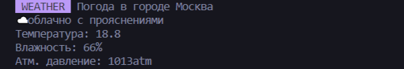

<!-- PROJECT LOGO -->
<br />
<div align="center">
  <h1 align="center">Weather-cli</h1>

  <p align="center">
    Консольная программа для вывода прогноза погоды
  </p>
</div>


<!-- ABOUT THE PROJECT -->
## О проекте

<div align="center">
  <span>
    
   </span>
</div>

Программа для вывода прогноза погоды в консоль


### Стек

* NodeJS
* JavaScript


<!-- GETTING STARTED -->
### Установка

1. Склонировать репозиторий
   ```sh
   git clone https://github.com/Regina5425/weather-cli
   ```
2. Установить NPM пакеты
   ```sh
   npm install
   ```
3. Зарегистрироваться на сайте <a href="https://openweathermap.org/">OpenWeather</a> и получить API_KEY 
4. Вывод справки для работы с программой
		```js
		node weather.js -h
		```
5. Запустить программу с помощью команды
		```js
		npm start
		```


<!-- CONTACT -->
## Контакты

E-mail: reina5425@gmail.com
